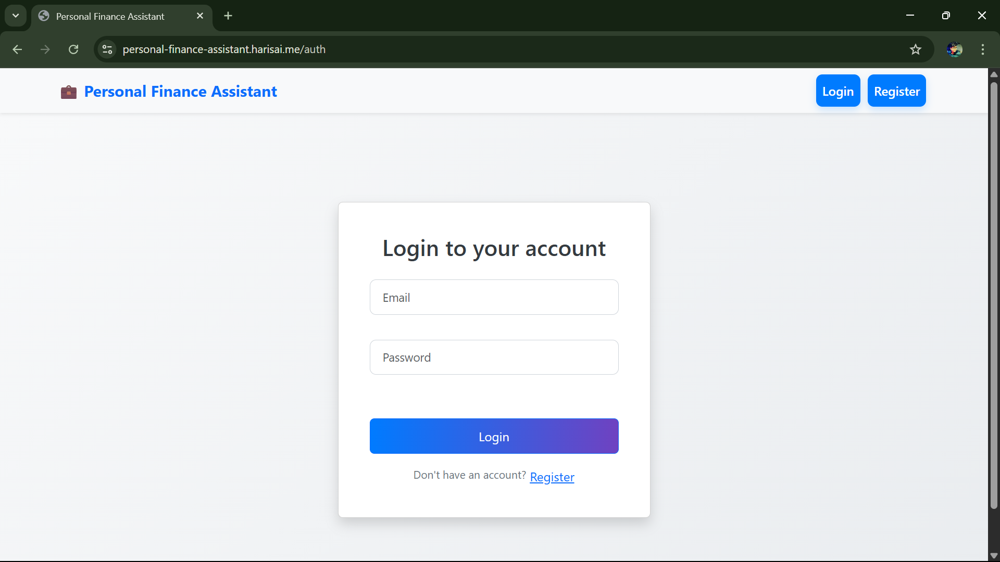
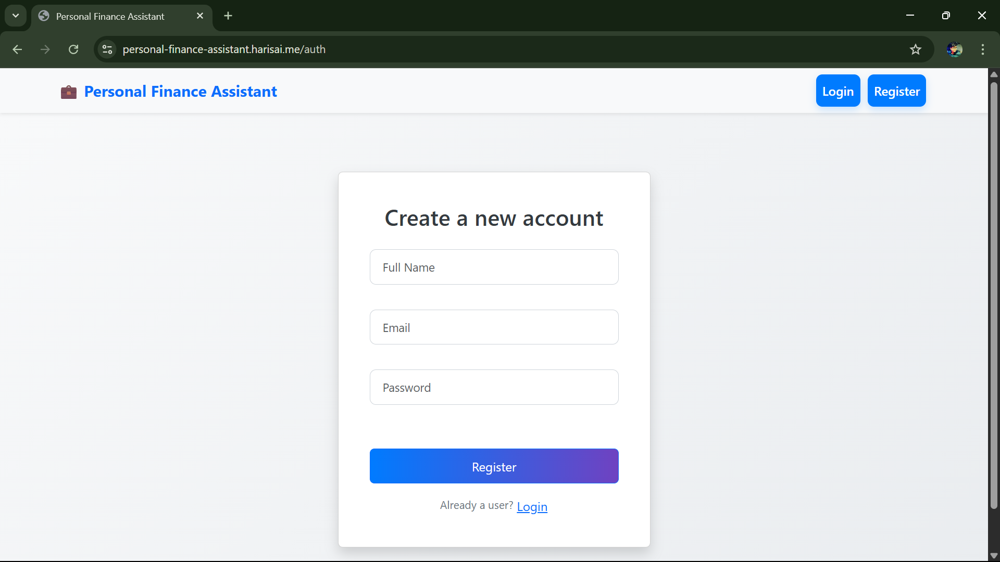
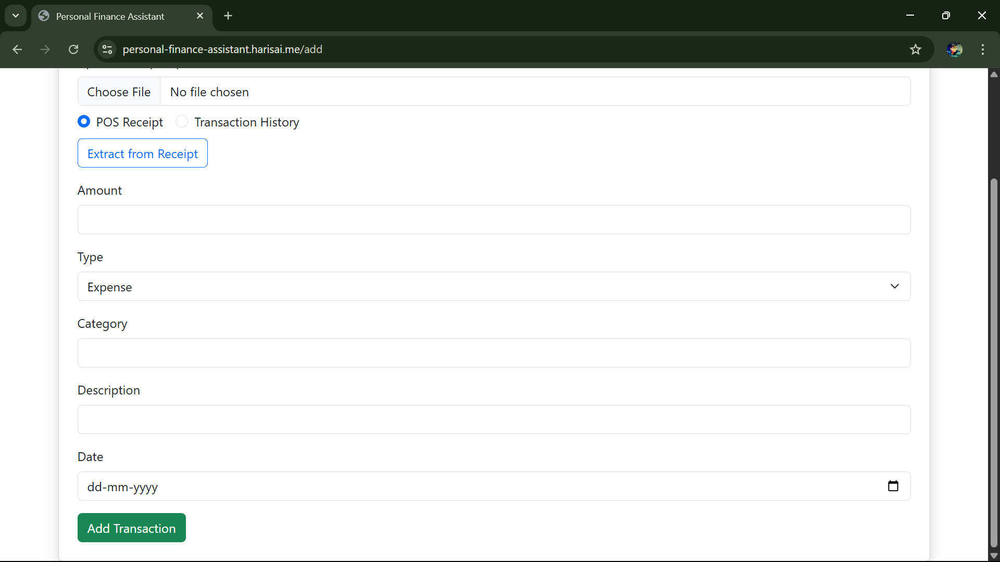
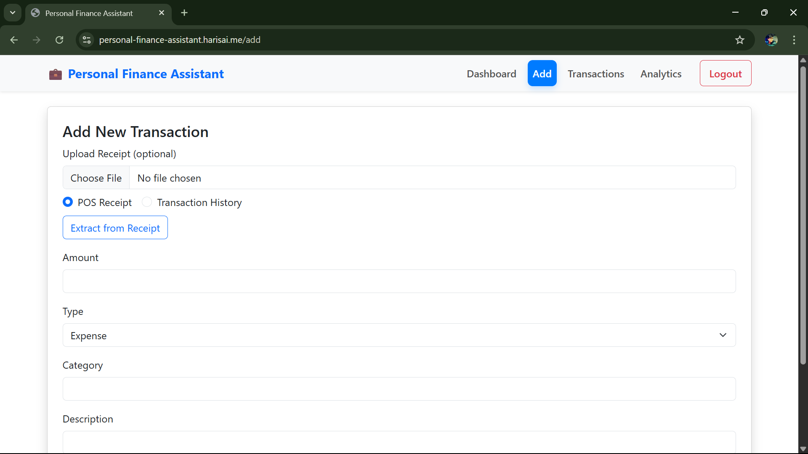
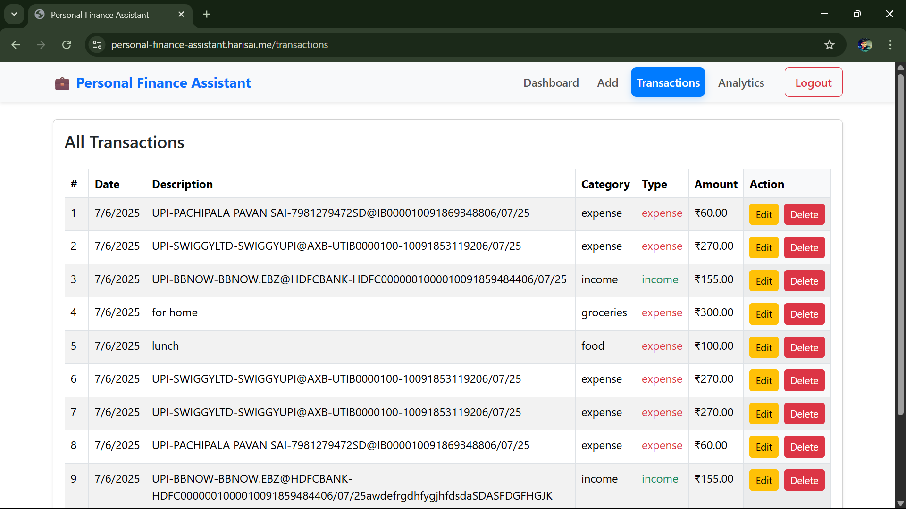
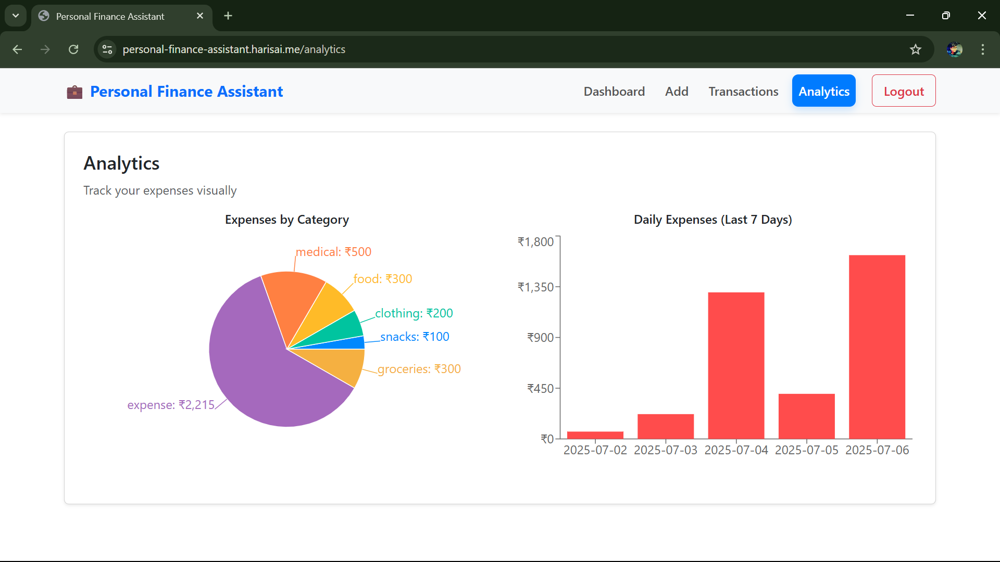

# [💰 Personal Finance Assistant](https://personal-finance-assistant.harisai.me)

[](https://www.youtube.com/watch?v=S1YkRdP0I5Q)

A full-stack MERN (MongoDB, Express, React, Node.js) web app to **track, manage, and analyze personal financial activities**. Users can log expenses/incomes, upload receipts (POS or bank statement PDFs), auto-extract transaction data using GenAI (Google Gemini), and view categorized summaries with charts.

---

## 🚀 Features

* 🔐 User Authentication (JWT-based)
* ➕ Add/Edit/Delete Transactions
* 📁 Upload Receipts (PDF/Image)
  * POS Receipts → Auto-extract single transaction
  * Transaction History (bank PDFs) → Auto-insert multiple transactions
* 📊 Dashboard with Summary & Graphs (Pie/Bar)
* 📄 Paginated Transaction List
* 📦 Receipt Extraction using:
  * Tesseract OCR (image-based)
  * Gemini 1.5 Flash (via Google Generative AI SDK)

---

## 🏗️ Tech Stack

| Layer        | Tech Stack                                                           |
| ------------ | -------------------------------------------------------------------- |
| **Frontend** | React.js, React Bootstrap, Axios, React Router                       |
| **Backend**  | Node.js, Express.js, MongoDB, Mongoose                               |
| **Auth**     | JWT, bcryptjs                                                        |
| **OCR & AI** | `tesseract.js`, `pdf-parse`, `pdf-poppler`, Google Generative AI SDK |
| **Charts**   | Recharts                                                             |
| **Testing**  | Jest, Supertest (for backend testing)                                |

---

## 📂 Folder Structure

```bash
personal-finance-assistant/
├── client/                   # React Frontend
│   ├── src/
│   │   ├── components/
│   │   ├── pages/
│   │   └── services/
│   └── public/
├── server/                   # Node/Express Backend
│   ├── controllers/
│   ├── models/
│   ├── routes/
│   ├── middleware/
│   ├── utils/
│   └── tests/
└── README.md
```

---

## 🔧 Installation & Setup

### 1. Clone the repo

```bash
git clone https://github.com/harisai2005/personal-finance-assistant.git
cd personal-finance-assistant
```

### 2. Setup Backend

```bash
cd server
npm install
touch .env
```

#### .env example:

```
PORT=5000
MONGO_URI=mongodb://localhost:27017/financeDB
JWT_SECRET=your_jwt_secret
GEMINI_API_KEY=your_google_gemini_api_key
```

```bash
npm run dev  # start backend on http://localhost:5000
```

### 3. Setup Frontend

```bash
cd ../client
npm install
npm start  # open React app on http://localhost:3000
```

---

## 📸 Screenshots

### 🔐 Login


### 📝 Register


### 📊 Dashboard


### ➕ Add Transaction


### 📂 Upload Receipt


### 📋 Transactions


### 📈 Analytics


---

## 🧪 Testing (Backend)

```bash
cd server
npm test
```

---

## ⚙️ API Endpoints

### Auth

* `POST /api/auth/register`
* `POST /api/auth/login`

### Transactions

* `POST /api/transactions`
* `GET /api/transactions`
* `PUT /api/transactions/:id`
* `DELETE /api/transactions/:id`
* `GET /api/transactions/summary`
* `GET /api/transactions/daily`

### Receipt Upload

* `POST /api/upload` (`FormData` with `file` and `mode`)

---

## 💡 Receipt Extraction Logic

1. User uploads image/pdf.
2. Backend determines:
   * If it's digital PDF → use `pdf-parse`
   * If image-based → use Tesseract OCR
3. Extracted text sent to Gemini 1.5 Flash with prompt based on `mode`:
   * `pos`: Single invoice → one transaction
   * `history`: Bank statement → multiple entries
4. Clean Gemini response & insert into DB.

---

## 📌 Deployment Notes

* Backend can be deployed to **Render / Railway / Heroku**.
* Frontend can be deployed to **Vercel / Netlify**.
* Use environment variables for secrets.

---

## 👨‍💻 Author

**Hari Sai Surishetti**  
[GitHub](https://github.com/harisai2005) | [LinkedIn](https://www.linkedin.com/in/Harisai-Surishetti)

---

## 🏁 Future Enhancements

* 🔄 Export to CSV/PDF
* 📱 Mobile-responsive UI improvements
* 🔎 Full-text search and filters
* 📬 Email reports & reminders
* 💵 Budget planning

---
